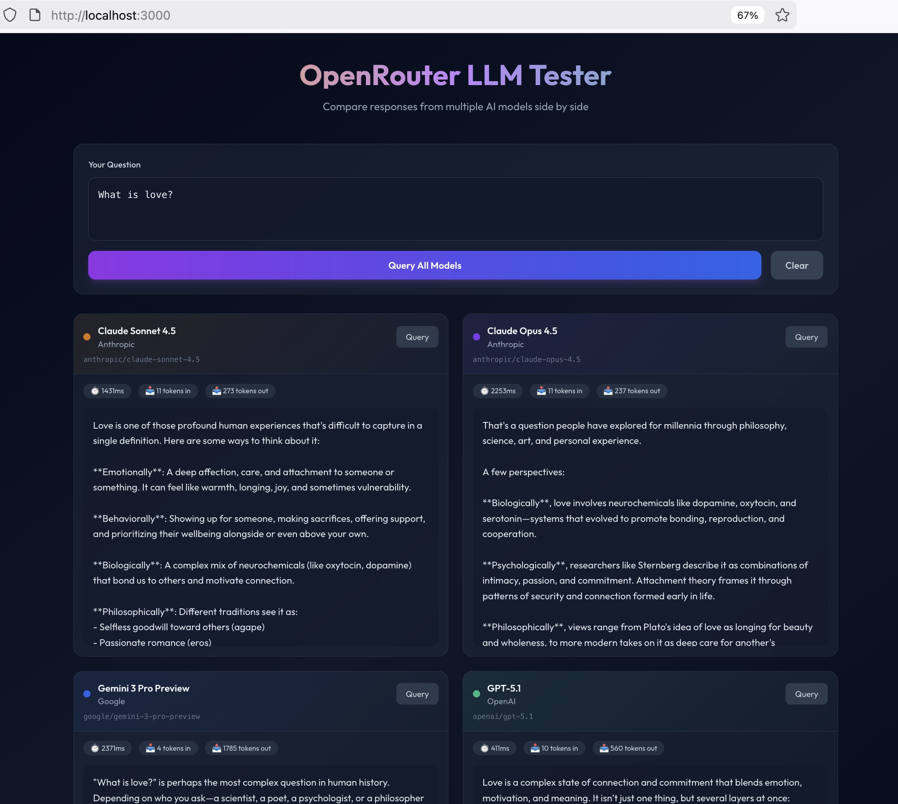

# OpenRouter LLM Tester

A Next.js application to test and compare responses from multiple LLM models via the OpenRouter API.

## Features

- Test multiple LLM models simultaneously
- Side-by-side comparison of responses
- Response time and token usage tracking
- Beautiful, modern UI

## Screenshot



## Supported Models

- **Claude Sonnet 4.5** (Anthropic)
- **Claude Opus 4.5** (Anthropic)
- **Gemini 3 Pro Preview** (Google)
- **GPT-5.1** (OpenAI)

## Setup

### 1. Install dependencies

```bash
pnpm install
```

### 2. Configure environment variables

Create a `.env.local` file in the root directory:

```bash
# OpenRouter API Key
# Get your API key from https://openrouter.ai/keys
OPENROUTER_API_KEY=your_openrouter_api_key_here
```

### 3. Run the development server

```bash
pnpm dev
```

Open [http://localhost:3000](http://localhost:3000) with your browser to see the result.

## Usage

1. Enter your question in the text area (default: "What is love?")
2. Click "Query All Models" to send the question to all models simultaneously
3. Or click individual "Query" buttons to test specific models
4. Compare the responses, response times, and token usage

## Tech Stack

- [Next.js 15](https://nextjs.org/) - React framework
- [TypeScript](https://www.typescriptlang.org/) - Type safety
- [Tailwind CSS](https://tailwindcss.com/) - Styling
- [OpenRouter API](https://openrouter.ai/) - LLM API gateway

## API Reference

### POST /api/chat

Send a prompt to a specific model.

**Request Body:**
```json
{
  "modelId": "anthropic/claude-sonnet-4.5",
  "prompt": "What is love?"
}
```

**Response:**
```json
{
  "model": {
    "id": "anthropic/claude-sonnet-4.5",
    "name": "Claude Sonnet 4.5",
    "provider": "Anthropic",
    "color": "#D97706"
  },
  "response": "...",
  "responseTime": 1234,
  "usage": {
    "prompt_tokens": 10,
    "completion_tokens": 150,
    "total_tokens": 160
  },
  "rawModel": "anthropic/claude-sonnet-4"
}
```

### GET /api/chat

Get the list of available models.

## License

MIT

